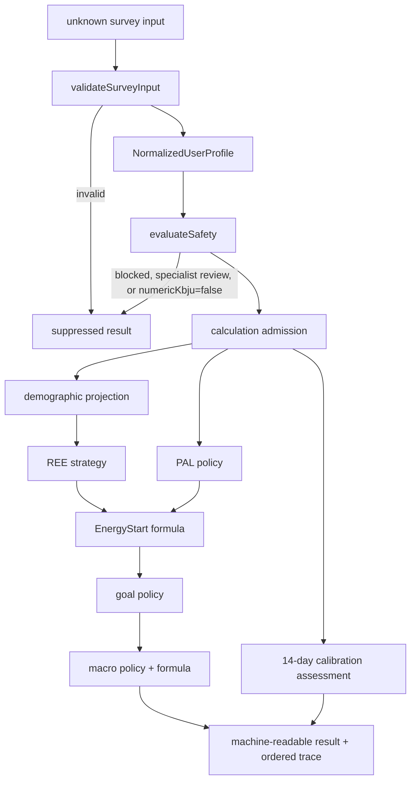

# Phase 2 — production calculation core architecture

Status: design only. This document defines contracts and boundaries; it does not authorize or implement calculation behavior.

## 1. Scope and invariants

The calculation core is a framework-independent, deterministic library. It must not read environment variables, clocks, databases, files, network state, React state, or framework request objects. Every result is a pure function of an admitted input and an explicit version bundle.

Phase 1 remains the mandatory safety boundary. A calculation may begin only after `validateSurveyInput` returns a normalized profile and `evaluateSafety` returns capabilities. Invalid input, `medicalGateway=blocked`, `medicalGateway=specialist_review`, or `capabilities.numericKbju=false` must produce a suppressed result with all numeric fields `null`. This preserves the minor-user prohibition and prevents callers from bypassing safety by invoking an internal formula.

All energy values are starting planning references, not measured requirements or confidence intervals. PAL presets remain explicitly demonstrative. No diagnosis is produced. Automatic energy reduction and automatic calibration correction remain disabled.

Phase 2C1 uses exact questionnaire values only. Ordinary activity is one of `mostly_sitting`, `lots_of_walking`, `physically_active_work`, or `fitness_2_4_week`; legacy `low`, `moderate`, and `high` values fail closed. Athlete scenarios use the exact athlete level, numeric single-session duration, and explicit double-day boolean. Energy is `REE_unrounded × PAL_final`, rounded to the nearest 50 kcal with ties to even. Goals retain multiplier `1.00`. Non-calculated production variants omit REE, PAL, energy, and KBJU fields entirely; specialist review remains number-free.

## 2. Module map

```text
core/
  types.ts                  Phase 1 survey and safety contracts
  validation.ts             Phase 1 runtime input validation
  safety.ts                 Phase 1 capability and medical gateway
  calculation/
    types.ts                Phase 2 public contracts (created now)
    admission.ts            future: convert Phase 1 output to admitted/suppressed input
    demographics.ts         future: validated demographic projection
    formulas/
      ree.ts                future: formula only, no policy decisions
      energy.ts             future: multiplication and explicit rounding only
      macros.ts             future: macro arithmetic and closure checks only
    policies/
      pal.ts                future: versioned demo-preset selection and limitations
      goals.ts              future: goal permission and multiplier selection
      macro-policy.ts       future: coefficient selection and medical suppression
      calibration.ts        future: eligibility and review policy
    trace.ts                future: ordered explainability records
    pipeline.ts             future: sole public calculation orchestrator
    index.ts                stable public calculation exports
  index.ts                  package-level public API
```

Only `types.ts` and the export surfaces are introduced in this design phase. The future file names describe intended ownership, not implemented modules.

## 3. Data flow



Admission is fail-closed. Formula modules never receive raw survey input and never decide whether a user is medically eligible. Policy modules select permitted strategies and coefficients; formula modules perform only documented arithmetic.

## 4. Public TypeScript contracts

The proposed interfaces are defined in `core/calculation/types.ts` and re-exported from `core/index.ts`.

- `ValidatedCalculationInput` combines the normalized Phase 1 profile, safety result, canonical demographics, PAL discriminator, goal, versions, and optional calibration observations.
- `CalculationAdmission` records whether calculation and numeric output are permitted. A future constructor must create it; callers must not synthesize admission implicitly.
- `ReeStrategyDescriptor`, `PalPolicyDescriptor`, and `MacroCoefficientSet` make selected formula/policy metadata explicit.
- `ReeResult`, `PalResult`, `EnergyStartResult`, `GoalScenarioResult`, and `MacroScenarioResult` expose intermediate results.
- `CalibrationInput`, `CalibrationObservationDay`, and `CalibrationResult` model the minimum fourteen-day concept without persistence.
- `CalculationError`, `CalculationWarning`, and `CalculationTraceEntry` provide machine-readable explanation.
- `CalculationResult` is a discriminated union. Numeric results contain all stages; suppressed results make every numeric stage `null`.

The future stable runtime API should be deliberately small:

```ts
type AdmitCalculation = (
  validation: ValidationResult,
  eligibility: RecommendationEligibility,
  request: CalculationRequest,
) => CalculationAdmissionResult;

type CalculateStartingReference = (
  input: AdmittedCalculationInput,
) => CalculationResult;
```

These signatures are illustrative only and are not exported now because their exact request/admission boundary depends on unresolved goal mapping and policy approval.

## 5. Calculation stages

### Stage 0 — admission

Verify Phase 1 validity, profile presence, calculation-core version, `numericKbju`, age restriction, and medical gateway. Any failure produces `SuppressedCalculationResult`; no downstream stage runs.

### Stage 1 — demographics and anthropometry

Project only `ageYears`, `sexForFormula`, `heightCm`, `weightKg`, and `ageGroup` from the normalized profile. Do not re-interpret survey aliases. Phase 1 remains responsible for technical validation and adult/minor consistency.

### Stage 2 — REE strategy

Policy selects the adult Mifflin–St Jeor strategy from the version bundle. The formula module returns raw kcal/day and a separately rounded display value. It must not apply PAL, goals, medical rules, or UI formatting.

### Stage 3 — PAL model

Policy chooses a versioned demo preset from the discriminated athlete/general input and day type, then applies only a documented duration modifier. It returns base, modifier, final value, clamp/rounding metadata, and limitations. Double days must retain `DOUBLE_DURATION_UNKNOWN` and must not reuse one session duration as two sessions.

### Stage 4 — EnergyStart

The formula multiplies unrounded REE by the selected demo PAL and rounds to the documented 50-kcal increment. Both raw and rounded values remain in the result and trace. It is labelled a starting reference and never a measured need.

### Stage 5 — goal policy

The normalized architecture supports `maintenance`, `weight_loss`, `weight_gain`, and `recomposition`, but does not assume how survey goal labels map to them. Maintenance uses the reference path. Weight-loss and recomposition reduction remain disabled and retain multiplier `1.00`. The specification documents a `1.05` demonstration multiplier for muscle gain, but its relationship to generic `weight_gain` requires an explicit mapping decision. Safety and medical policy can suppress a goal before any multiplier is passed to formula code.

### Stage 6 — macro allocation

Policy selects three coefficient sets; formula code computes protein, fat, carbohydrate, macro energy, and deviation. The result always has ordered `lower`, `central`, and `upper` slots. Kidney or other relevant medical restrictions must suppress protein coefficient selection rather than allow formulas to guess. Minors and non-eligible medical states receive no macro scenarios. Scenario energy interpretation (`±6%`) remains explicitly sensitivity planning, not uncertainty probability.

### Stage 7 — fourteen-day calibration

Calibration consumes observations supplied by the caller; it does not load or persist them. Eligibility checks the minimum 14-day window, at least 10 complete intake days, sufficient morning weights, safety state, contradictions, and wellbeing. Possible outputs are `insufficient_data`, `calibrated_anchor`, `review_before_apply`, or `specialist_review`. A proposed step is bounded by the documented 5%, but is never automatically applied. Wearable expenditure is recorded only as an auxiliary trend.

### Stage 8 — result assembly

Assemble one versioned discriminated result, ordered issues, and ordered trace. Identical admitted input and versions must produce structurally identical output. Timestamps and hashes belong to an outer persistence/report layer unless supplied as explicit input; the pure core must not read the clock.

## 6. Formula and policy separation

| Formula module | Receives | Must not decide |
|---|---|---|
| REE | validated adult demographics + strategy | age eligibility, medical state, strategy version |
| Energy | raw REE + PAL + rounding instruction | PAL preset or goal permission |
| Macros | energy, weight, explicit coefficients | coefficient selection or medical applicability |

| Policy module | Owns |
|---|---|
| Admission | Phase 1 capability enforcement and suppression |
| PAL | preset lookup, day semantics, modifier permission, limitation warnings |
| Goals | goal mapping, permitted multiplier, reduction-disabled behavior |
| Macro policy | profile coefficient selection and medical suppression |
| Calibration | data sufficiency, review routing, non-automatic adjustment policy |

Numeric helpers should accept explicit rounding increments and contain no NutriMind policy constants. Policy tables must be immutable, versioned data colocated with their policy module.

## 7. Errors, warnings, and uncertainty

Errors are terminal for the affected calculation and contain `code`, `stage`, optional `path`, `message`, and optional `ruleId`. Warnings preserve a usable result while describing limitations. Codes, rather than message text, are the stable machine interface.

Examples of terminal errors are invalid admission, unsupported core version, minor numeric output, and a blocked medical gateway. Examples of warnings are demo PAL limitations, unknown double-day duration, disabled reduction, macro closure review, and insufficient calibration data.

Uncertainty is represented structurally, not as false statistical precision:

- `isMeasured=false` and `palIsDemoPreset=true` are mandatory;
- raw values and documented rounded values are separate;
- scenario labels are planning sensitivities, not confidence bounds;
- missing inputs create scoped warnings or suppression, never inferred values;
- calibration proposals require review and are never automatically applied.

## 8. Calculation trace

Each `CalculationTraceEntry` records deterministic sequence, stage, versioned rule, exact input paths/values, strategy plus parameters, exact outputs, and warning codes. The intended chain is:

```text
answer/profile field → versioned policy rule → selected strategy/coefficient → raw result → rounded/suppressed result
```

Trace values are JSON-compatible and contain no functions, dates created from the system clock, or framework objects. Message localization is outside the trace contract.

## 9. Test strategy

Implementation tests should import only the public production API and must not copy formulas into test files.

1. Admission table tests: every Phase 1 status/capability combination, especially minors and all three medical states.
2. REE strategy tests: specification example, sex-specific constants, raw/display separation, adult boundary.
3. PAL table tests: every profile/day cell, duration boundaries 45/46/90/91, clamp/rounding, and double-day warning.
4. Energy tests: raw multiplication and 50-kcal rounding boundaries.
5. Goal policy tests: maintenance, disabled loss/recomposition, approved gain behavior, safety suppression.
6. Macro tests: each profile band, 20% fat floor, closure within 0.5 kcal, negative-carbohydrate review, kidney suppression.
7. Calibration tests: 13/14-day boundary, 9/10 intake days, weight frequency, median anchor, 5% ceiling, medical/LEA review.
8. Trace tests: stable ordering, rule versions, raw and rounded values, no missing stages.
9. Determinism/property tests: same input/version gives deep-equal output; finite outputs; no numeric data in suppressed result.
10. Contract/type tests: exhaustive handling of result and goal discriminators.

## 10. Unresolved ambiguities

No implementation should resolve these by assumption:

1. The approved survey describes an energy range of `±100 kcal`; calculation core `0.1.1-draft` specifies sensitivity scenarios `0.94 / 1.00 / 1.06`.
2. Survey `dailyActivity` has `low/moderate/high`, while the PAL table has four differently named ordinary-user categories, including a fitness-training category. There is no approved mapping.
3. Athlete goals and general-user goals use different labels. The requested generic goals (`maintenance`, `weight_loss`, `weight_gain`, `recomposition`) do not have a complete approved mapping.
4. The `1.05` multiplier is specified for muscle gain, not generic body-weight gain. Its use for `weight_gain` is unresolved.
5. Safety screening remains “на отдельное утверждение”. Therefore no future path may enable weight-loss/recomposition reduction merely because Phase 1 accepts optional screening answers.
6. “Relevant medical flag” for suppressing protein coefficients is not enumerated beyond kidney disease.
7. Calibration does not define exact date-window semantics, the minimum count implied by “4 times per week”, acceptable weight stability, wellbeing thresholds, contradiction rules, median rounding, or how goals affect review.
8. The 5% calibration step has no rounding rule and no approval/apply workflow contract.
9. The specification does not define how missing daily observations differ from explicitly unknown values.
10. Hydration is specified in the calculation document but is not included in this task’s requested pipeline deliverables; its relationship to the final Phase 2 result needs an explicit scope decision.
11. Input hashing, `generated_at`, and cross-version reproduction are required by broader audit/recommendation documents, but a pure deterministic core cannot read time and no canonical serialization/hash contract is approved.
12. Numeric laboratory values are necessary but not sufficient for clinical diagnosis; reference-range interpretation and confirmed-deficiency policy remain outside calculation core scope.

## 11. Implementation sequence

1. Resolve and version the goal mapping, ordinary-user PAL mapping, and `±100` versus `±6%` decision without changing the survey specification.
2. Approve the runtime admission request and construct an opaque/admitted input boundary so internal formula functions cannot be called from raw input paths.
3. Implement shared deterministic numeric/rounding helpers with boundary tests.
4. Implement adult REE formula strategy and trace emission.
5. Implement PAL policy tables, modifiers, limitations, and exhaustive tests.
6. Implement EnergyStart formula and starting-reference metadata.
7. Implement goal policy with reduction disabled unless a future approved version explicitly changes it.
8. Implement macro coefficient policy, arithmetic, closure validation, and medical suppression.
9. Implement read-only calibration assessment after observation semantics are approved; keep apply/persistence outside the core.
10. Implement the pipeline orchestrator as the only public runtime calculation entry point and enforce suppression by construction.
11. Add complete production-import tests, determinism checks, and trace snapshots.
12. Integrate with an outer application layer only in a later authorized phase.

## 12. Implemented Phase 2C2 boundary

Phase 2C2 consumes only a real eligible `Phase2C1Result` with `status: calculated` and enriches each existing day scenario with the ordered nested macro scenarios `lower`, `central`, and `upper`. It does not recalculate REE, PAL, duration modifiers, day availability, or Phase 2C1 EnergyStart. The current result/session schema is `nutrimind.phase2c2.result.v1`; older Phase 2B and Phase 2C1 payloads are incompatible. Hydration, sweat rate, and fourteen-day calibration remain deferred.

## 13. Implemented Phase 2D1 boundary

Phase 2D1 consumes one completed `Phase2C2Result` plus explicit questionnaire hydration context. It never invokes Phase 1–2C2 again. A calculated result embeds the structurally unchanged Phase 2C2 result and adds two deliberately separate concepts: the EFSA adult total-water reference (`2000 ml/day` female, `2500 ml/day` male, beverages plus food water) and, for an athlete with a valid single-session duration, a general during-session range (`durationMinutes × 400/60` through `durationMinutes × 800/60`, displayed to the nearest 50 ml with ties to even). No combined daily target exists.

The session/result schema is `nutrimind.phase2d1.result.v1`. The questionnaire adapter maps only the three values actually rendered by production section 8 to `under_1_5_l`, `between_1_5_and_2_l`, or `over_2_l`; absence maps to `not_provided`, while any unknown non-empty value fails closed. The beverage category is context only and is never compared numerically with total water. Schema-declared `sweating` and `trainingDrink` remain outside production because the UI does not collect them.

Only a calculated adult Phase 2C2 result can receive numeric millilitre fields. `blocked`, `specialist_review`, `minor_suppressed`, and `invalid_input` carry neither the upstream numeric payload nor hydration numeric structures. A double-training scenario retains the valid range for the one entered session but has no double-day total and emits `double_session_duration_missing`. Sweat rate, environmental adjustments, electrolyte guidance, diagnoses, and fourteen-day calibration remain excluded.

## 14. Implemented Phase 2D2A boundary

Phase 2D2A is a separate observation-only route at `/calibration`; it is not part of the Phase 1–2D1 calculation pipeline. A new journal can be created only from a structurally compatible calculated `nutrimind.phase2d1.result.v1` in the current session and after unchecked-by-default consent `nutrimind.phase2d2a.consent.v1`. The durable record intentionally copies only source schema/status, ordinary-or-athlete classification, selected goal, and available day types. It never persists the Phase 2D1 object, nutrition numbers, hydration values, or baseline weight.

The single active record uses IndexedDB database `nutrimind-calibration`, version 1, with strict journal schema `nutrimind.phase2d2a.journal.v1`. Dates are local calendar dates: the window is start through start + 13 calendar days and the record becomes inaccessible after start + 30 calendar days. Writes replace the entry for the same date. Unsupported versions, unknown properties, invalid enums, duplicate/future/out-of-window dates, invalid numbers, and malformed metadata fail closed; no migration or fallback storage exists.

The derived `nutrimind.phase2d2a.summary.v1` is recomputed from source entries and is never persisted. It reports elapsed/logged days, missing dates, categorical counts, dated weight observations and atypical-context coverage. It computes no trend, causal interpretation, recommendation, or adjustment. A safety-context action is explicit and confirmed; it changes the journal to `safety_context_changed` and permanently freezes entry editing. Phase 2D2B remains unimplemented and unauthorized.

## 15. Implemented Phase 3A1 boundary

Phase 3A1 is a deterministic child of a strictly validated Phase2D1 result. It does not rerun or modify Phase 1, REE, PAL, EnergyStart, Phase2C1, Phase2C2, hydration, goals, or the independent Phase2D2A journal.

The questionnaire preserves `nutrimind.phase2d1.result` and additionally writes `nutrimind.phase3a.result`. The latter uses schema `nutrimind.phase3a.result.v1`, carries the calculated parent only for calculated adult states, and carries no nutrition numbers or calculated parent for suppressed states. The production answer `selections[4]` is normalized to `one_or_two`, `three`, `four_or_more`, or `not_provided`; unknown non-empty values fail closed. It is display-only context.

The `/meal-structure` route requires explicit day, macro-scenario, and structure selection in current React state. It never serializes selections into a URL or durable storage. The approved structures have weights `1/1/1`, `3/3/1/3`, and `1/1/1/1`. A pure helper proportionally allocates displayed daily kcal and macro grams, rounds kcal to integers and macros to one decimal with ties-to-even, and assigns the exact residual to the final main meal. Daily displayed totals are invariant. Phase 3A2 training-relative timing and Phase 3B food selection remain unimplemented.

## 16. Implemented Phase 3A2 boundary

Phase 3A2 is an optional presentation layer over an already built Phase 3A1 plan. It supports only the existing athlete `training` day, only when the separate strict `nutrimind.phase3a2.context.v1` records one known coarse part of day. The production indices map exactly to `morning`, `daytime`, and `evening`; this context is displayed but never selects or restricts a boundary.

The user explicitly opts in and selects before the first eating occasion, one of the real adjacent gaps, or after the last occasion. A pure non-nutrition view model adds order-only relation labels without mutating, rebuilding, persisting, or reallocating the Phase 3A1 plan. The boundary exists only in React state and resets on plan inputs, plan rebuild, reset, or reload. Rest, ordinary `typical_day`, double-training, missing/unsupported context, malformed sessions, and non-calculated states receive no controls. The existing `nutrimind.phase3a.result.v1`, calculation trace, allocation weights, rounding, reconciliation, daily totals, hydration and calibration remain unchanged. Phase 3B food selection remains unimplemented.

## 17. Implemented Phase 3B1 boundary

Phase 3B1 is a schema-less pure presentation module outside nutrition calculation. It exposes exactly four equal-status abstract slots: `protein_source`, `carbohydrate_source`, `vegetables_fruit_berries`, and `fat_source`. The same immutable set appears in a closed native disclosure under every existing meal card only after a calculated Phase 3A1 plan exists.

It contains no products, portions, composition data, restriction filtering, macro matching, timing derivation, persistence, transport, or medical interpretation. Phase 3A1 numbers and Phase 3A2 relations remain unchanged. Concrete-food hard exclusions are not implemented and require a separately approved Phase 3B2 boundary.
