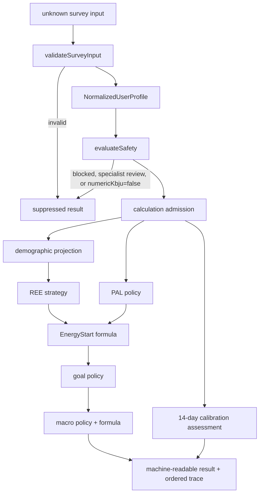

# Phase 2 — production calculation core architecture

Status: design only. This document defines contracts and boundaries; it does not authorize or implement calculation behavior.

## 1. Scope and invariants

The calculation core is a framework-independent, deterministic library. It must not read environment variables, clocks, databases, files, network state, React state, or framework request objects. Every result is a pure function of an admitted input and an explicit version bundle.

Phase 1 remains the mandatory safety boundary. A calculation may begin only after `validateSurveyInput` returns a normalized profile and `evaluateSafety` returns capabilities. Invalid input, `medicalGateway=blocked`, `medicalGateway=specialist_review`, or `capabilities.numericKbju=false` must produce a suppressed result with all numeric fields `null`. This preserves the minor-user prohibition and prevents callers from bypassing safety by invoking an internal formula.

All energy values are starting planning references, not measured requirements or confidence intervals. PAL presets remain explicitly demonstrative. No diagnosis is produced. Automatic energy reduction and automatic calibration correction remain disabled.

## 2. Module map

```text
core/
  types.ts                  Phase 1 survey and safety contracts
  validation.ts             Phase 1 runtime input validation
  safety.ts                 Phase 1 capability and medical gateway
  calculation/
    types.ts                Phase 2 public contracts (created now)
    admission.ts            future: convert Phase 1 output to admitted/suppressed input
    demographics.ts         future: validated demographic projection
    formulas/
      ree.ts                future: formula only, no policy decisions
      energy.ts             future: multiplication and explicit rounding only
      macros.ts             future: macro arithmetic and closure checks only
    policies/
      pal.ts                future: versioned demo-preset selection and limitations
      goals.ts              future: goal permission and multiplier selection
      macro-policy.ts       future: coefficient selection and medical suppression
      calibration.ts        future: eligibility and review policy
    trace.ts                future: ordered explainability records
    pipeline.ts             future: sole public calculation orchestrator
    index.ts                stable public calculation exports
  index.ts                  package-level public API
```

Only `types.ts` and the export surfaces are introduced in this design phase. The future file names describe intended ownership, not implemented modules.

## 3. Data flow



Admission is fail-closed. Formula modules never receive raw survey input and never decide whether a user is medically eligible. Policy modules select permitted strategies and coefficients; formula modules perform only documented arithmetic.

## 4. Public TypeScript contracts

The proposed interfaces are defined in `core/calculation/types.ts` and re-exported from `core/index.ts`.

- `ValidatedCalculationInput` combines the normalized Phase 1 profile, safety result, canonical demographics, PAL discriminator, goal, versions, and optional calibration observations.
- `CalculationAdmission` records whether calculation and numeric output are permitted. A future constructor must create it; callers must not synthesize admission implicitly.
- `ReeStrategyDescriptor`, `PalPolicyDescriptor`, and `MacroCoefficientSet` make selected formula/policy metadata explicit.
- `ReeResult`, `PalResult`, `EnergyStartResult`, `GoalScenarioResult`, and `MacroScenarioResult` expose intermediate results.
- `CalibrationInput`, `CalibrationObservationDay`, and `CalibrationResult` model the minimum fourteen-day concept without persistence.
- `CalculationError`, `CalculationWarning`, and `CalculationTraceEntry` provide machine-readable explanation.
- `CalculationResult` is a discriminated union. Numeric results contain all stages; suppressed results make every numeric stage `null`.

The future stable runtime API should be deliberately small:

```ts
type AdmitCalculation = (
  validation: ValidationResult,
  eligibility: RecommendationEligibility,
  request: CalculationRequest,
) => CalculationAdmissionResult;

type CalculateStartingReference = (
  input: AdmittedCalculationInput,
) => CalculationResult;
```

These signatures are illustrative only and are not exported now because their exact request/admission boundary depends on unresolved goal mapping and policy approval.

## 5. Calculation stages

### Stage 0 — admission

Verify Phase 1 validity, profile presence, calculation-core version, `numericKbju`, age restriction, and medical gateway. Any failure produces `SuppressedCalculationResult`; no downstream stage runs.

### Stage 1 — demographics and anthropometry

Project only `ageYears`, `sexForFormula`, `heightCm`, `weightKg`, and `ageGroup` from the normalized profile. Do not re-interpret survey aliases. Phase 1 remains responsible for technical validation and adult/minor consistency.

### Stage 2 — REE strategy

Policy selects the adult Mifflin–St Jeor strategy from the version bundle. The formula module returns raw kcal/day and a separately rounded display value. It must not apply PAL, goals, medical rules, or UI formatting.

### Stage 3 — PAL model

Policy chooses a versioned demo preset from the discriminated athlete/general input and day type, then applies only a documented duration modifier. It returns base, modifier, final value, clamp/rounding metadata, and limitations. Double days must retain `DOUBLE_DURATION_UNKNOWN` and must not reuse one session duration as two sessions.

### Stage 4 — EnergyStart

The formula multiplies unrounded REE by the selected demo PAL and rounds to the documented 50-kcal increment. Both raw and rounded values remain in the result and trace. It is labelled a starting reference and never a measured need.

### Stage 5 — goal policy

The normalized architecture supports `maintenance`, `weight_loss`, `weight_gain`, and `recomposition`, but does not assume how survey goal labels map to them. Maintenance uses the reference path. Weight-loss and recomposition reduction remain disabled and retain multiplier `1.00`. The specification documents a `1.05` demonstration multiplier for muscle gain, but its relationship to generic `weight_gain` requires an explicit mapping decision. Safety and medical policy can suppress a goal before any multiplier is passed to formula code.

### Stage 6 — macro allocation

Policy selects three coefficient sets; formula code computes protein, fat, carbohydrate, macro energy, and deviation. The result always has ordered `lower`, `central`, and `upper` slots. Kidney or other relevant medical restrictions must suppress protein coefficient selection rather than allow formulas to guess. Minors and non-eligible medical states receive no macro scenarios. Scenario energy interpretation (`±6%`) remains explicitly sensitivity planning, not uncertainty probability.

### Stage 7 — fourteen-day calibration

Calibration consumes observations supplied by the caller; it does not load or persist them. Eligibility checks the minimum 14-day window, at least 10 complete intake days, sufficient morning weights, safety state, contradictions, and wellbeing. Possible outputs are `insufficient_data`, `calibrated_anchor`, `review_before_apply`, or `specialist_review`. A proposed step is bounded by the documented 5%, but is never automatically applied. Wearable expenditure is recorded only as an auxiliary trend.

### Stage 8 — result assembly

Assemble one versioned discriminated result, ordered issues, and ordered trace. Identical admitted input and versions must produce structurally identical output. Timestamps and hashes belong to an outer persistence/report layer unless supplied as explicit input; the pure core must not read the clock.

## 6. Formula and policy separation

| Formula module | Receives | Must not decide |
|---|---|---|
| REE | validated adult demographics + strategy | age eligibility, medical state, strategy version |
| Energy | raw REE + PAL + rounding instruction | PAL preset or goal permission |
| Macros | energy, weight, explicit coefficients | coefficient selection or medical applicability |

| Policy module | Owns |
|---|---|
| Admission | Phase 1 capability enforcement and suppression |
| PAL | preset lookup, day semantics, modifier permission, limitation warnings |
| Goals | goal mapping, permitted multiplier, reduction-disabled behavior |
| Macro policy | profile coefficient selection and medical suppression |
| Calibration | data sufficiency, review routing, non-automatic adjustment policy |

Numeric helpers should accept explicit rounding increments and contain no NutriMind policy constants. Policy tables must be immutable, versioned data colocated with their policy module.

## 7. Errors, warnings, and uncertainty

Errors are terminal for the affected calculation and contain `code`, `stage`, optional `path`, `message`, and optional `ruleId`. Warnings preserve a usable result while describing limitations. Codes, rather than message text, are the stable machine interface.

Examples of terminal errors are invalid admission, unsupported core version, minor numeric output, and a blocked medical gateway. Examples of warnings are demo PAL limitations, unknown double-day duration, disabled reduction, macro closure review, and insufficient calibration data.

Uncertainty is represented structurally, not as false statistical precision:

- `isMeasured=false` and `palIsDemoPreset=true` are mandatory;
- raw values and documented rounded values are separate;
- scenario labels are planning sensitivities, not confidence bounds;
- missing inputs create scoped warnings or suppression, never inferred values;
- calibration proposals require review and are never automatically applied.

## 8. Calculation trace

Each `CalculationTraceEntry` records deterministic sequence, stage, versioned rule, exact input paths/values, strategy plus parameters, exact outputs, and warning codes. The intended chain is:

```text
answer/profile field → versioned policy rule → selected strategy/coefficient → raw result → rounded/suppressed result
```

Trace values are JSON-compatible and contain no functions, dates created from the system clock, or framework objects. Message localization is outside the trace contract.

## 9. Test strategy

Implementation tests should import only the public production API and must not copy formulas into test files.

1. Admission table tests: every Phase 1 status/capability combination, especially minors and all three medical states.
2. REE strategy tests: specification example, sex-specific constants, raw/display separation, adult boundary.
3. PAL table tests: every profile/day cell, duration boundaries 45/46/90/91, clamp/rounding, and double-day warning.
4. Energy tests: raw multiplication and 50-kcal rounding boundaries.
5. Goal policy tests: maintenance, disabled loss/recomposition, approved gain behavior, safety suppression.
6. Macro tests: each profile band, 20% fat floor, closure within 0.5 kcal, negative-carbohydrate review, kidney suppression.
7. Calibration tests: 13/14-day boundary, 9/10 intake days, weight frequency, median anchor, 5% ceiling, medical/LEA review.
8. Trace tests: stable ordering, rule versions, raw and rounded values, no missing stages.
9. Determinism/property tests: same input/version gives deep-equal output; finite outputs; no numeric data in suppressed result.
10. Contract/type tests: exhaustive handling of result and goal discriminators.

## 10. Unresolved ambiguities

No implementation should resolve these by assumption:

1. The approved survey describes an energy range of `±100 kcal`; calculation core `0.1.1-draft` specifies sensitivity scenarios `0.94 / 1.00 / 1.06`.
2. Survey `dailyActivity` has `low/moderate/high`, while the PAL table has four differently named ordinary-user categories, including a fitness-training category. There is no approved mapping.
3. Athlete goals and general-user goals use different labels. The requested generic goals (`maintenance`, `weight_loss`, `weight_gain`, `recomposition`) do not have a complete approved mapping.
4. The `1.05` multiplier is specified for muscle gain, not generic body-weight gain. Its use for `weight_gain` is unresolved.
5. Safety screening remains “на отдельное утверждение”. Therefore no future path may enable weight-loss/recomposition reduction merely because Phase 1 accepts optional screening answers.
6. “Relevant medical flag” for suppressing protein coefficients is not enumerated beyond kidney disease.
7. Calibration does not define exact date-window semantics, the minimum count implied by “4 times per week”, acceptable weight stability, wellbeing thresholds, contradiction rules, median rounding, or how goals affect review.
8. The 5% calibration step has no rounding rule and no approval/apply workflow contract.
9. The specification does not define how missing daily observations differ from explicitly unknown values.
10. Hydration is specified in the calculation document but is not included in this task’s requested pipeline deliverables; its relationship to the final Phase 2 result needs an explicit scope decision.
11. Input hashing, `generated_at`, and cross-version reproduction are required by broader audit/recommendation documents, but a pure deterministic core cannot read time and no canonical serialization/hash contract is approved.
12. Numeric laboratory values are necessary but not sufficient for clinical diagnosis; reference-range interpretation and confirmed-deficiency policy remain outside calculation core scope.

## 11. Implementation sequence

1. Resolve and version the goal mapping, ordinary-user PAL mapping, and `±100` versus `±6%` decision without changing the survey specification.
2. Approve the runtime admission request and construct an opaque/admitted input boundary so internal formula functions cannot be called from raw input paths.
3. Implement shared deterministic numeric/rounding helpers with boundary tests.
4. Implement adult REE formula strategy and trace emission.
5. Implement PAL policy tables, modifiers, limitations, and exhaustive tests.
6. Implement EnergyStart formula and starting-reference metadata.
7. Implement goal policy with reduction disabled unless a future approved version explicitly changes it.
8. Implement macro coefficient policy, arithmetic, closure validation, and medical suppression.
9. Implement read-only calibration assessment after observation semantics are approved; keep apply/persistence outside the core.
10. Implement the pipeline orchestrator as the only public runtime calculation entry point and enforce suppression by construction.
11. Add complete production-import tests, determinism checks, and trace snapshots.
12. Integrate with an outer application layer only in a later authorized phase.
